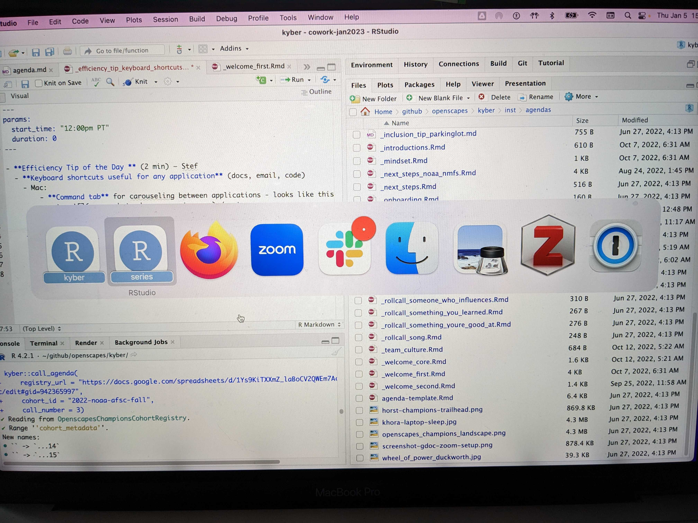

- **Efficiency Tip of the Day ** (2 min) – Stef
  - **Keyboard shortcuts useful for any application** (docs, email, code)
    - Mac:
        - **Command tab** for carouseling between applications - looks like this
        

        - **Command `**  for carouseling between windows in an application e.g. browser, RStudio
        - **Command option arrow** for carouseling between tabs (browser)
    - Windows:
        - **Alt-tab** or **Windows-tab**
        - **Alt-tab** again or **Alt-shift-tab** to go backwards
        - **Control page up / page down** for carouseling between tabs (browser)
