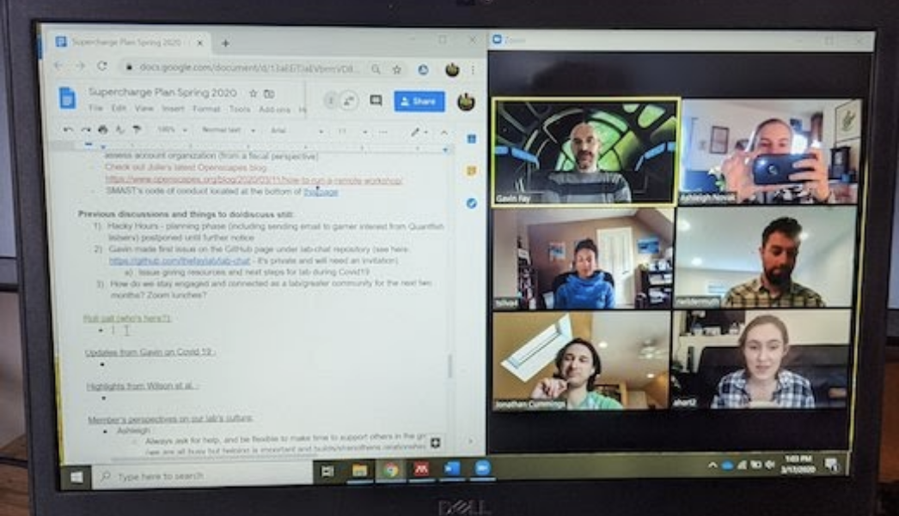

---
params:
  start_time: "1:00pm ET"
  duration: 13
  files: ["openscapes_champions_landscape.png", "screenshot-gdoc-zoom-setup.png", "wheel_of_power_duckworth.jpg"]
---

## Welcome • `r kyber:::fmt_duration(params$start_time, params$duration)`

-   **Welcome to Openscapes!** 👋 (3 min) – Julie

    -   We are so excited to work with you! Thank you to organizers and coordinators and everyone here.
    -   We are now recording this meeting.
    -   Live transcriptions are available.
    -   **Cohort goals**
        -   To strengthen habits for immediate benefit that will help create long-lasting resilience in teams and workflows. Focus on open science.
    -   **Today’s goals**
        -   ‎
    -   **Our team here on this call:**
        -   Julie Lowndes / Openscapes
        -   Stefanie Butland / Openscapes
        -   Ileana Fenwick / Openscapes
        -   Andy Teucher / Openscapes
        -   Openscapes Mentors - huge expertise; they can share and help answer questions
    -   **Land Acknowledgment** (Julie): I am grateful for the land where I am here in Santa Barbara California and I want to honor the Chumash peoples who have been and continue to be stewards of the lands and waters here.
    -   Here’s a place you can go to learn more about where you are: <https://native-land.ca>.

    ‎

-   **Organizer Welcome** (2 min) – co-lead

    -   ‎
    -   

-   **You are all welcome here** (3 min) – Julie

    -   This is a positive learning space where everyone is welcome to ask questions and participate.
    -   Our Code of Conduct ([full version](https://www.openscapes.org/code-of-conduct/))
        -   Be respectful and value each other’s ideas, styles and viewpoints.
        -   Be direct but professional.
        -   Be open to learning from others.
        -   Lead by example and match your actions with your words.
        -   If you have issues, please direct them to:
            -   Julie - [julie\@openscapes.org](mailto:julie@openscapes.org)
    -   We are all responsible for being aware of [positionality](https://indigenousinitiatives.ctlt.ubc.ca/classroom-climate/positionality-and-intersectionality/) & power dynamics - how differences in social position and power shape identities and access in society. We want to be mindful of how hierarchy can get in the way of our learning. Here, we’ll work to flatten that hierarchy.
    -   We know there is a range of technical experience – by design! We are all here because we want to improve something about our work. We all bring value in our experiences, questions, and skills.
    -   We’re all imperfect and learning together – Openscapes included
        -   We're all accountable to each other
        -   Vulnerability: yes! Shame: no.
        -   If something doesn’t feel right, let’s talk about it
    -   The pandemic still affecting us, the climate emergency, it’s all a lot. ‎

-   **Many paths forward, together** (3 min) – Julie

*Think about where are you showing up today*

-   **Openscapes mindset - Reinforcing ideas**

    -   You are not alone.
    -   Open science tooling & communities exist that are powerful and empowering.
    -   We can harness this power broadly to create the culture we want to be a part of.

-   **How We Work (Tech & Cultural Norms)** (2 min) – Julie

    -   Our 5 Cohort Calls - Cohort website: `r params_registry$cohort_website`

    -   Zoom & Google Docs – I put mine side-by-side (windows narrowed); “faces on” when possible but ok to mute/face-mute for any reason

        

        -   Please contribute to the agenda doc throughout the call, help capture Cohort wisdom:
            -   Direct editing
            -   Create a new bullet by hitting return
            -   Shortcut to create new bullet:
                -   Mac: Shift - Command - 8
                -   Windows: Shift - Control - 8
            -   Comments / emojis / gifs / +1s to say “me too” are welcome! 🤓
                -   Insert \> Emoji: 🦑 🎉

-   **Questions** before we get started?

    -   

    -   
